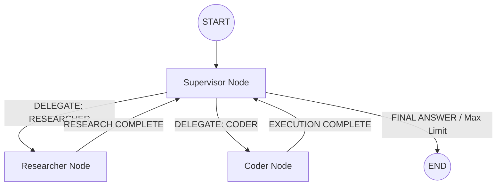

# Supervisory MAS Execution Graph

## Static Topology

```mermaid
flowchart TD
    START((START)) --> Supervisor[Supervisor Node]
    Supervisor -->|DELEGATE: RESEARCHER| Researcher[Researcher Node]
    Supervisor -->|DELEGATE: CODER| Coder[Coder Node]
    Supervisor -->|FINAL ANSWER / Max Limit| END((END))
    Researcher -->|RESEARCH COMPLETE| Supervisor
    Coder -->|EXECUTION COMPLETE| Supervisor

```

## Runtime Execution Trace

```mermaid
flowchart LR
    S1["START: InitGraph"] -->|"Delegate"| S2["Supervisor: Delegate"]
    S2["Supervisor: Delegate"] -->|"ResearchComplete"| S3["Researcher: ResearchComplete"]
    S3["Researcher: ResearchComplete"] -->|"Delegate"| S4["Supervisor: Delegate"]
    S4["Supervisor: Delegate"] -->|"ExecutionComplete"| S5["Coder: ExecutionComplete"]
    S5["Coder: ExecutionComplete"] -->|"Finish"| S6["Supervisor: Finish"]
    S6["Supervisor: Finish"] -->|"FinishGraph"| S7["END: FinishGraph"]
```
